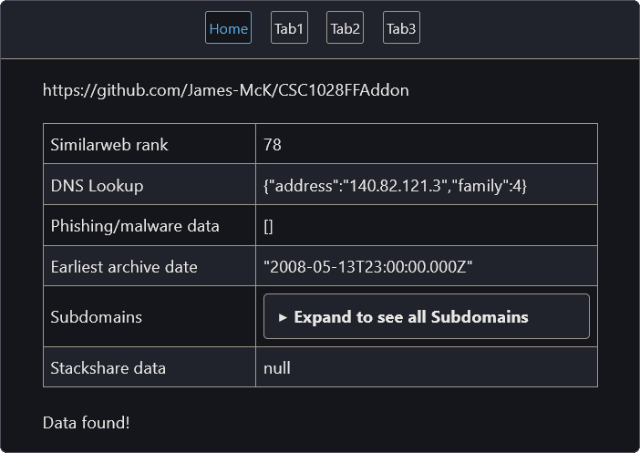

## Browser Addon

See <https://mck.is/CSC1028> for further details.

The browser addon is extremely similar to the electron app, providing a user-friendly front end to the data, built with HTML and javascript. As it is integrated into the browser, it can automatically fetch and cache data as the user navigates the web.  
Note: The addon currently only supports Firefox, however it could be ported to support Chromium-based browsers extremely easily, as both share an extremely similar base API, with only a few functions being located in different namespaces, but providing the same results. (See [Chrome incompatibilities](https://developer.mozilla.org/en-US/docs/Mozilla/Add-ons/WebExtensions/Chrome_incompatibilities) on MDN for details)

The addon's UI is also currently lacking as I chose to shift focus away from it, as I decided the Electron UI was more important initially. However, since both are based on HTML and javascript, and the Electron app was built upon the framework of the browser addon, the updates for the Electron app should be able to be ported without too much effort.

### Installing the addon

(Currently Firefox-only)  
Installing the addon is thankfully easy. Navigate to `about:debugging` and click on the "This Firefox" tab. Click on "Load Temporary Add-on..." and navigate to the folder containing the addon files. Click on any of the files (e.g. `manifest.json`) and load it. The addon is now loaded! Whenever you update your code and save it, you just need to click the "Reload" button that appears.  
I'd also recommend looking at [MDN](https://developer.mozilla.org/en-US/docs/Mozilla/Add-ons/WebExtensions) for excellent documentation of the WebExtension APIs.

### Further development

The browser addon is similar in concept to the electron application, except with the front-end for displaying data being decoupled from the backend for requesting data.

The backend is stored in `backround.js`, which as the name suggests, runs in the background. It uses event listeners to tell when the user changes to a different tab/web page, and if the data for that page has not been requested, request it and cache it by storing it in the addon storage.

The front-end is in `popup/urlInfo.html` (This, and the background script file, are determined in `manifest.json`.), which provides a UI similar to the electron app whenever the user clicks on the toolbar button, which queries the cache and displays the data for the user's current tab.
